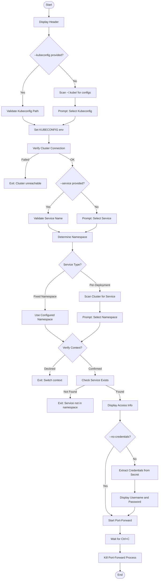
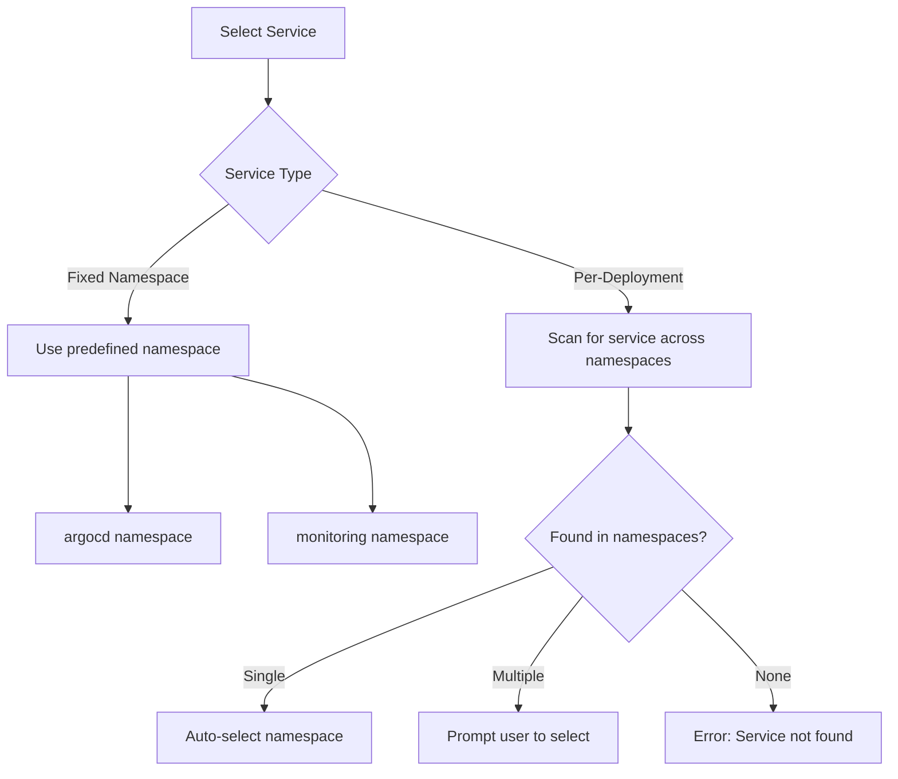
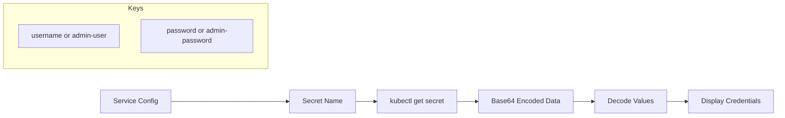

# Admin Script

Port-forwarding tool for Kubernetes admin UIs with automatic credential extraction.

## Overview

The admin script (`scripts/admin.ts`) provides quick access to cluster administration interfaces like ArgoCD, Grafana, Prometheus, MinIO, and Mailpit. It handles kubeconfig selection, service discovery, credential extraction, and port-forward tunnel management.

## Prerequisites

| Tool | Required | Purpose |
|------|----------|---------|
| `kubectl` | Yes | Kubernetes cluster interaction |

## Usage

```bash
# Interactive mode (prompts for all options)
bun scripts/admin.ts

# Direct service access
bun scripts/admin.ts --service argocd
bun scripts/admin.ts --service grafana
bun scripts/admin.ts --service prometheus

# With specific kubeconfig
bun scripts/admin.ts --kubeconfig ~/.kube/my-cluster

# With specific namespace (for per-deployment services)
bun scripts/admin.ts --service minio --namespace acme-staging

# Skip credential display
bun scripts/admin.ts --service grafana --no-credentials

# Legacy positional argument
bun scripts/admin.ts argocd
```

## Options

| Flag | Description |
|------|-------------|
| `--service <name>` | Service to access (see table below) |
| `--kubeconfig <path>` | Path to kubeconfig file |
| `--namespace <name>` | Override namespace selection |
| `--no-credentials` | Skip credential extraction |
| `--help` | Show help message |

## Supported Services

| Service | Namespace | Local Port | Credentials |
|---------|-----------|------------|-------------|
| `argocd` | `argocd` | 8080 | Secret: `argocd-initial-admin-secret` |
| `grafana` | `monitoring` | 8080 | Secret: `monitoring-grafana` |
| `prometheus` | `monitoring` | 9090 | None |
| `alertmanager` | `monitoring` | 9093 | None |
| `minio` | Per-deployment | 9001 | Secret: `minio` |
| `mailpit` | Per-deployment | 8025 | None (dev/staging only) |

## How It Works

### Interactive Flow



### Service Selection Logic



### Credential Extraction



## Service Details

### ArgoCD

```bash
bun scripts/admin.ts --service argocd
```

- **URL**: http://localhost:8080
- **Username**: `admin`
- **Password**: From `argocd-initial-admin-secret`

### Grafana

```bash
bun scripts/admin.ts --service grafana
```

- **URL**: http://localhost:8080
- **Username**: `admin`
- **Password**: From `monitoring-grafana` secret

### Prometheus

```bash
bun scripts/admin.ts --service prometheus
```

- **URL**: http://localhost:9090
- **No authentication required**

### MinIO (Per-Deployment)

```bash
bun scripts/admin.ts --service minio --namespace acme-staging
```

- **URL**: http://localhost:9001
- **Username**: From `minio` secret
- **Password**: From `minio` secret

### Mailpit (Per-Deployment)

```bash
bun scripts/admin.ts --service mailpit --namespace acme-staging
```

- **URL**: http://localhost:8025
- **No authentication required**
- **Note**: Dev/staging environments only

## Non-Interactive Mode

For automation or scripts, provide all required flags:

```bash
# Full non-interactive access
bun scripts/admin.ts \
  --kubeconfig ~/.kube/production \
  --service grafana \
  --no-credentials
```

When stdin is not a TTY, the script:
- Requires `--service` flag
- Auto-selects first available namespace for per-deployment services
- Skips context confirmation

## Error Handling

| Error | Cause | Solution |
|-------|-------|----------|
| `Kubeconfig not found` | Invalid path | Check file path |
| `Cluster unreachable` | Wrong context or cluster down | Verify cluster status |
| `Service not specified` | Non-interactive without `--service` | Provide `--service` flag |
| `Service not found in namespace` | Service not deployed | Check `kubectl get svc -n <namespace>` |
| `Secret not found` | Credentials not created | Check secret exists in namespace |

## Signal Handling

The script handles graceful shutdown:

- **SIGINT** (Ctrl+C): Kills port-forward subprocess, exits cleanly
- **SIGTERM**: Same as SIGINT

## Related Scripts

- [PROVISION.md](./PROVISION.md) - Provision cluster first
- [BOOTSTRAP.md](./BOOTSTRAP.md) - Install ArgoCD before accessing
- [SECRETS.md](./SECRETS.md) - Manage secrets for services like MinIO
