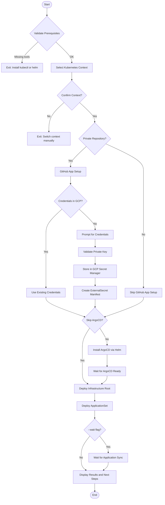
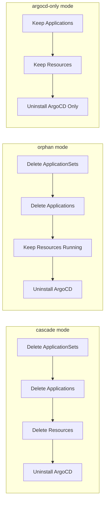
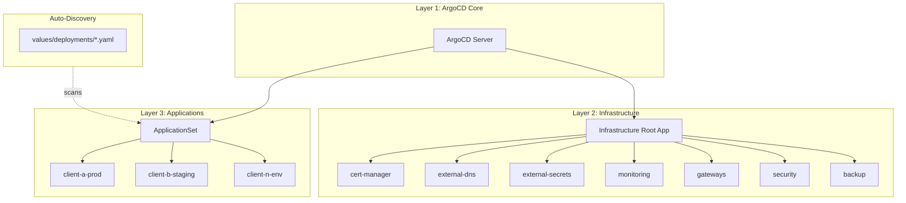
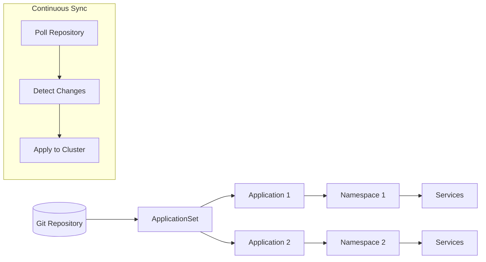
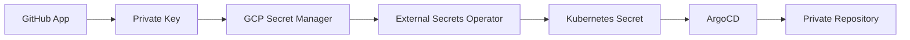

# Bootstrap Script

Unified ArgoCD installation and GitOps cluster bootstrap.

## Overview

The bootstrap script (`scripts/bootstrap.ts`) sets up a complete GitOps pipeline using ArgoCD. It handles ArgoCD installation, GitHub App authentication for private repositories, and deploys the infrastructure root application that manages all cluster components.

## Prerequisites

| Tool | Required | Purpose |
|------|----------|---------|
| `kubectl` | Yes | Kubernetes cluster interaction |
| `helm` | Yes | Package management for ArgoCD |
| `gcloud` | Optional | GCP Secret Manager integration |

## Usage

```bash
# Basic bootstrap
bun scripts/bootstrap.ts

# Skip ArgoCD installation (already installed)
bun scripts/bootstrap.ts --skip-argocd

# Skip GitHub App setup (public repo)
bun scripts/bootstrap.ts --skip-github-app

# Wait for full application sync
bun scripts/bootstrap.ts --wait

# Non-interactive mode
bun scripts/bootstrap.ts --yes

# Destroy cluster bootstrap
bun scripts/bootstrap.ts --destroy

# Destroy with specific mode
bun scripts/bootstrap.ts --destroy --mode cascade
```

## Options

### Bootstrap Flags

| Flag | Description |
|------|-------------|
| `--kubeconfig <path>` | Custom kubeconfig file |
| `--context <name>` | Kubernetes context to use |
| `--skip-argocd` | Skip ArgoCD installation |
| `--skip-github-app` | Skip GitHub App setup |
| `--wait` | Wait for full application sync |
| `--dry-run` | Preview without executing |
| `--yes` | Auto-approve (non-interactive) |

### GitHub App Flags

| Flag | Description |
|------|-------------|
| `--app-id <id>` | GitHub App ID |
| `--installation-id <id>` | Installation ID |
| `--private-key-path <path>` | Path to private key file |

### Destruction Flags

| Flag | Description |
|------|-------------|
| `--destroy` | Enable destruction mode |
| `--mode <mode>` | `cascade`, `orphan`, or `argocd-only` |

## How It Works

### Bootstrap Flow



### Destruction Modes



### Three-Tier Deployment Architecture



### GitOps Workflow



## GitHub App Setup

For private repositories, the script guides you through GitHub App creation:

1. **Create GitHub App** at `https://github.com/settings/apps/new`
2. **Configure Permissions**: Repository contents (read-only)
3. **Install App** on your repository
4. **Provide Credentials**: App ID, Installation ID, Private Key
5. **Credentials are stored** in GCP Secret Manager
6. **ExternalSecret** syncs credentials to Kubernetes

### Credential Flow



## Configuration

### Key Files

| Path | Purpose |
|------|---------|
| `values/infrastructure/main.yaml` | ArgoCD and infrastructure configuration |
| `charts/argocd-bootstrap/` | Bootstrap Helm chart |
| `values/deployments/*.yaml` | Per-client/environment configurations |
| `backups/applications-*/` | Application backups before destruction |

### ArgoCD Configuration

| Setting | Value |
|---------|-------|
| Chart Version | 7.7.12 |
| Replicas | 1 (non-HA) |
| Repo Server Memory | 1536Mi request / 2560Mi limit |
| Sync Timeout | 10-20 minutes |

## Destruction Modes Comparison

| Mode | Applications | Resources | ArgoCD | Use Case |
|------|--------------|-----------|--------|----------|
| `cascade` | Deleted | Deleted | Removed | Full cleanup |
| `orphan` | Deleted | **Kept** | Removed | Keep workloads, remove GitOps |
| `argocd-only` | **Kept** | **Kept** | Removed | Just remove ArgoCD |

## Error Handling

| Error | Cause | Solution |
|-------|-------|----------|
| `kubectl not found` | Missing CLI | Install kubectl |
| `helm not found` | Missing package manager | Install Helm |
| `Cluster unreachable` | Wrong context or down | Check kubeconfig and cluster |
| `Private key invalid` | Wrong format | Use PEM format RSA key |
| `ArgoCD not ready` | Installation failed | Check ArgoCD pods in `argocd` namespace |

## Related Scripts

- [PROVISION.md](./PROVISION.md) - Provision cluster before bootstrap
- [ADMIN.md](./ADMIN.md) - Access ArgoCD UI after bootstrap
- [SECRETS.md](./SECRETS.md) - Manage application secrets
