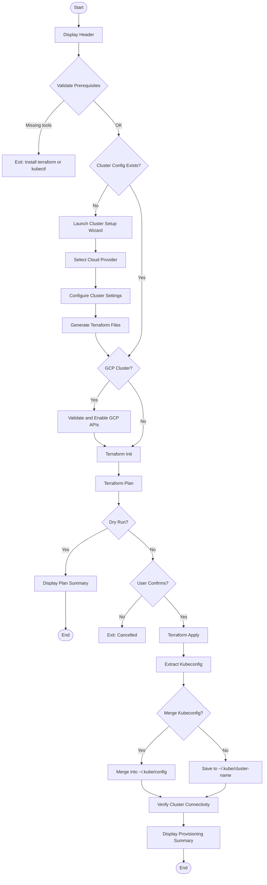
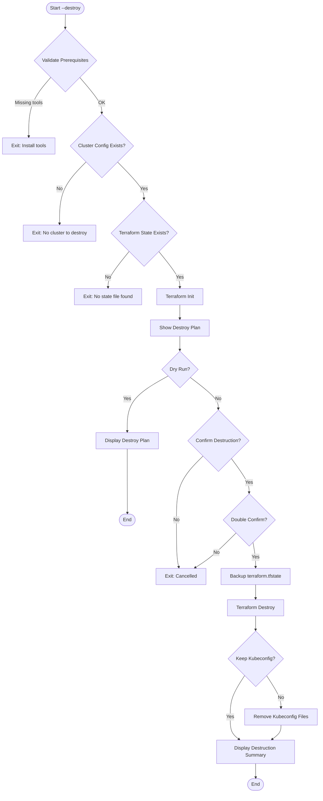

# Provision Script

Unified Kubernetes cluster provisioning and destruction using Terraform/OpenTofu.

## Overview

The provision script (`scripts/provision.ts`) manages the complete lifecycle of Kubernetes clusters across multiple cloud providers. It replaces the legacy `provision.sh` and `teardown.sh` scripts with a single TypeScript-based tool.

## Prerequisites

| Tool | Required | Purpose |
|------|----------|---------|
| `terraform` or `tofu` | Yes | Infrastructure as Code engine |
| `kubectl` | Yes | Kubernetes CLI for verification |
| `gcloud` | Optional | GCP API validation (GKE only) |
| `docker` | Optional | Required for k3d local clusters |

## Usage

```bash
# Basic provisioning
bun scripts/provision.ts

# Provision with kubeconfig merging
bun scripts/provision.ts --merge-kubeconfig

# Preview changes (dry-run)
bun scripts/provision.ts --dry-run

# Auto-approve (skip confirmations)
bun scripts/provision.ts --auto-approve

# Destroy cluster
bun scripts/provision.ts --destroy

# Preview destruction
bun scripts/provision.ts --destroy --dry-run
```

## Options

### Provisioning Flags

| Flag | Description |
|------|-------------|
| `--dry-run` | Preview changes without executing |
| `--auto-approve`, `--yes` | Skip confirmation prompts |
| `--merge-kubeconfig` | Merge kubeconfig into `~/.kube/config` |

### Destruction Flags

| Flag | Description |
|------|-------------|
| `--destroy` | Enable destruction mode |
| `--keep-kubeconfig` | Preserve kubeconfig files after destruction |
| `--dry-run` | Preview destruction plan |

### Wizard Automation Flags

| Flag | Description |
|------|-------------|
| `--provider <provider>` | `aws-eks`, `do-doks`, `gcp-gke`, or `k3d` |
| `--project-id <id>` | GCP project ID |
| `--region <region>` | Cloud region |
| `--cluster-name <name>` | Cluster name |
| `--deployment-profile <size>` | `small`, `medium`, or `large` |

## How It Works

### Provisioning Flow



### Destruction Flow



## Cloud Provider Support

| Provider | Type | Key Features |
|----------|------|--------------|
| `aws-eks` | Managed | AWS EKS with node groups |
| `gcp-gke` | Managed | GKE with Workload Identity |
| `do-doks` | Managed | DigitalOcean Kubernetes |
| `k3d` | Local | Lightweight k3s in Docker |

### Deployment Profiles

| Profile | Nodes | Node Size | Use Case |
|---------|-------|-----------|----------|
| `small` | 1-2 | Minimal | Development |
| `medium` | 2-3 | Standard | Staging |
| `large` | 3+ | High-memory | Production |

## Configuration

### File Locations

| Path | Purpose |
|------|---------|
| `values/cluster/terraform.tfvars` | Cluster configuration variables |
| `values/cluster/main.tf` | Terraform main configuration |
| `values/cluster/terraform.tfstate` | Terraform state (do not edit) |
| `~/.kube/<cluster-name>` | Extracted kubeconfig |
| `backups/terraform-state/` | State backups before destruction |

### Example terraform.tfvars

```hcl
cluster_name = "my-cluster"
region       = "us-central1"
project_id   = "my-gcp-project"

node_pools = {
  default = {
    machine_type = "e2-standard-4"
    min_nodes    = 1
    max_nodes    = 3
  }
}
```

## Error Handling

| Error | Cause | Solution |
|-------|-------|----------|
| `terraform not found` | Missing IaC tool | Install Terraform or OpenTofu |
| `kubectl not found` | Missing Kubernetes CLI | Install kubectl |
| `No cluster configuration` | First run without wizard | Run wizard or provide `--provider` flag |
| `Apply cancelled` | User declined confirmation | Re-run with `--auto-approve` or confirm |
| `State file not found` | No existing infrastructure | Nothing to destroy |

## Related Scripts

- [BOOTSTRAP.md](./BOOTSTRAP.md) - Install ArgoCD after provisioning
- [ADMIN.md](./ADMIN.md) - Access cluster admin UIs
- [SECRETS.md](./SECRETS.md) - Configure secret management
