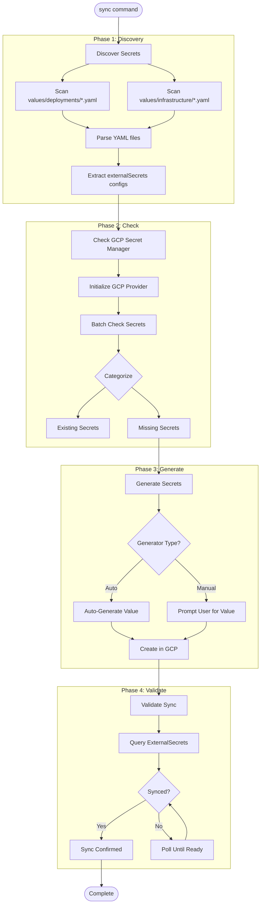
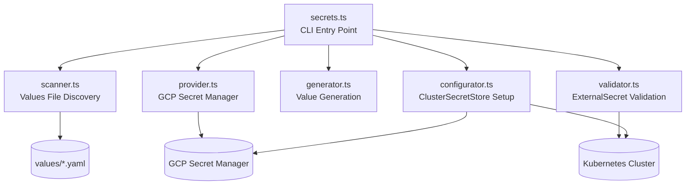
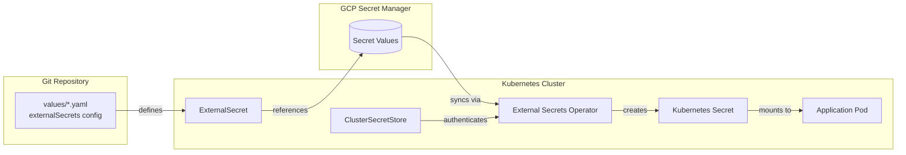
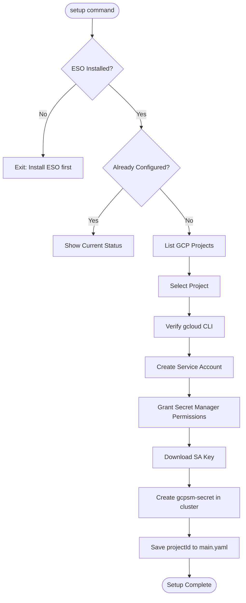

# Secrets Script

Values-driven secrets management with GCP Secret Manager integration.

## Overview

The secrets script (`scripts/secrets.ts`) provides a complete secrets management system that:

- Discovers secrets defined in values files
- Manages secrets in GCP Secret Manager
- Auto-generates cryptographically secure values
- Validates ExternalSecret synchronization to Kubernetes

## Prerequisites

| Tool | Required | Purpose |
|------|----------|---------|
| `kubectl` | Yes | Kubernetes cluster interaction |
| `gcloud` | Yes | GCP Secret Manager access |

**Cluster Requirements:**
- External Secrets Operator installed
- ClusterSecretStore configured

## Usage

```bash
# Discover all secrets defined in values files
bun scripts/secrets.ts discover

# Check which secrets exist in GCP
bun scripts/secrets.ts check

# Setup ClusterSecretStore (first-time)
bun scripts/secrets.ts setup

# Generate missing secrets
bun scripts/secrets.ts generate

# Validate ExternalSecret sync status
bun scripts/secrets.ts validate

# Full workflow: discover + check + generate + validate
bun scripts/secrets.ts sync

# Filter by deployment
bun scripts/secrets.ts check --deployment acme-staging

# Specify GCP project
bun scripts/secrets.ts check --project my-gcp-project

# Dry-run mode
bun scripts/secrets.ts generate --dry-run
```

## Commands

| Command | Purpose |
|---------|---------|
| `discover` | Scan values files and list all defined secrets |
| `check` | Compare values definitions against GCP Secret Manager |
| `setup` | Initialize ClusterSecretStore with GCP credentials |
| `generate` | Create missing secrets in GCP (auto or manual) |
| `validate` | Verify ExternalSecrets are syncing to Kubernetes |
| `sync` | Full workflow: discover + check + generate + validate |
| `help` | Display command reference |

## Options

| Flag | Description |
|------|-------------|
| `-d, --deployment <name>` | Filter by specific deployment |
| `-p, --project <id>` | GCP project ID |
| `--kubeconfig <path>` | Path to kubeconfig file |
| `--dry-run` | Preview changes without making them |
| `-y, --yes` | Skip confirmation prompts |
| `-h, --help` | Show help |

## How It Works

### Full Sync Workflow



### Module Architecture



### Secret Sync Flow



## Module Details

### scanner.ts - Values File Discovery

Scans YAML files and extracts secrets with `externalSecrets.enabled: true`.

**Supported Patterns:**

Pattern 1: Single secret
```yaml
postgresql:
  externalSecrets:
    enabled: true
    remoteKey: acme-staging-postgresql-password
    generator:
      generate: true
      type: password
```

Pattern 2: Multiple secrets
```yaml
minio:
  externalSecrets:
    enabled: true
    secrets:
      - remoteKey: acme-staging-minio-root-password
        generator:
          generate: true
          type: password
      - remoteKey: acme-staging-minio-secret-key
        generator:
          generate: true
          type: key
```

### generator.ts - Value Generation

| Type | Description | Default Length | Characters |
|------|-------------|----------------|------------|
| `password` | Alphanumeric + special | 32 | `a-zA-Z0-9!@#$%^&*` |
| `key` | Alphanumeric only | 32 | `a-zA-Z0-9` |
| `token` | Hex-encoded | 64 (32 bytes) | `0-9a-f` |
| `base64` | Base64-encoded | 44 (32 bytes) | Base64 charset |
| `urlsafe` | URL-safe base64 | 43 | URL-safe base64 |

### provider.ts - GCP Integration

**Project Detection Priority:**
1. ClusterSecretStore in running cluster
2. `values/infrastructure/main.yaml` configuration
3. `gcloud config` default project
4. User prompt

**Concurrency:** 10 parallel API calls for batch operations

### validator.ts - Sync Verification

**Status Checks:**
- ExternalSecret `Ready` condition
- ExternalSecret `SecretSynced` condition
- Target Kubernetes secret exists
- Last sync timestamp

**Polling:** 2-second interval, 60-second timeout

## ClusterSecretStore Setup

The `setup` command automates GCP integration:



## Configuration Reference

### Values File Schema

```yaml
chartName:
  externalSecrets:
    enabled: true                    # Enable for this chart
    secretStore: gcp-secretstore     # ClusterSecretStore name
    refreshInterval: 1h              # Sync frequency

    # Single secret
    remoteKey: deployment-chart-key  # GCP secret ID

    # OR multiple secrets
    secrets:
      - remoteKey: secret-1
        secretKey: PASSWORD          # Key in K8S secret
        generator:
          generate: true
          type: password
          length: 48                 # Optional custom length

      - remoteKey: secret-2
        generator:
          generate: false            # Manual input required
          description: "API key from vendor"
```

### Infrastructure Configuration

`values/infrastructure/main.yaml`:

```yaml
externalSecrets:
  enabled: true
  clusterSecretStore:
    name: gcp-secretstore
    provider: gcp
    projectId: my-gcp-project
```

## Error Handling

| Error | Cause | Solution |
|-------|-------|----------|
| `GCP authentication failed` | Invalid credentials | Run `gcloud auth login` |
| `ClusterSecretStore not found` | Not configured | Run `setup` command |
| `ESO not installed` | Missing operator | Install External Secrets Operator |
| `Permission denied` | SA lacks permissions | Grant `secretmanager.secretAccessor` |
| `ExternalSecret not syncing` | Configuration error | Check ESO logs and secret reference |

## Security Considerations

- **No secrets in Git**: Use `generator.generate: true` for auto-generation
- **Cryptographic generation**: Uses Node.js `crypto.randomBytes()`
- **Minimal permissions**: Service account only needs Secret Manager access
- **Dry-run mode**: Preview changes before applying
- **Idempotent operations**: Safe to run multiple times

## Related Scripts

- [PROVISION.md](./PROVISION.md) - Provision cluster first
- [BOOTSTRAP.md](./BOOTSTRAP.md) - Install External Secrets Operator
- [ADMIN.md](./ADMIN.md) - Access services that use secrets
